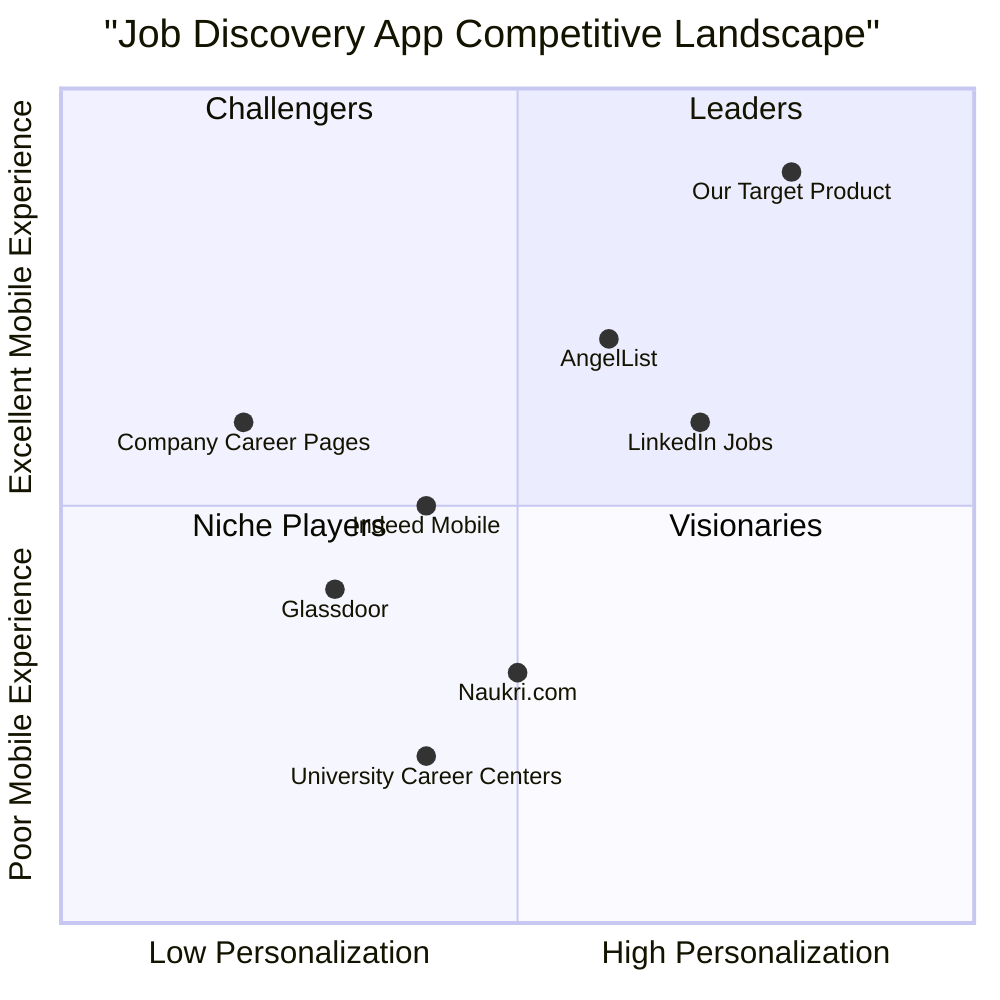

# Product Requirements Document (PRD)
# Job Discovery Mobile App

## Document Information
- **Document Version**: 1.0
- **Created Date**: July 3, 2025
- **Language**: English
- **Programming Language**: React Native, TypeScript, Tailwind CSS
- **Project Name**: job_discovery_app (YTD)
- **Last Updated**: July 3, 2025

## Original Requirements Restatement
Create a cross-platform mobile app that helps job and internship seekers discover curated, personalized opportunities sourced directly from company career pages via a custom-built scraping engine. The app focuses on streamlined user onboarding, intelligent filtering and recommendations, real-time job alerts, and a clean, distraction-free experience. Users are redirected to original job listings to apply, ensuring legal simplicity and leveraging trusted application channels.
## 1. Product Definition

### 1.1 Product Goals

**Goal 1: Streamline Job Discovery Process**
- Reduce time-to-find relevant opportunities from hours to minutes through intelligent curation and personalized recommendations
- Success Metric: Average time from app open to job application redirect < 5 minutes

**Goal 2: Maximize Job Matching Accuracy**
- Deliver highly relevant job opportunities based on user preferences, skills, and career stage
- Success Metric: >70% of users save at least 3 jobs per week, >40% click-through rate to application pages

**Goal 3: Establish Trusted Job Data Source**
- Build comprehensive, up-to-date job database through reliable scraping of company career pages
- Success Metric: >90% job posting accuracy, <24 hour data freshness, 500+ active companies

### 1.2 User Stories

**US1: Quick Profile Setup**
As a recent graduate, I want to create my profile in under 3 minutes so that I can start discovering relevant opportunities immediately without lengthy onboarding.

**US2: Personalized Job Feed**
As a career changer, I want to see jobs filtered by my new target industry and skill level so that I don't waste time on irrelevant opportunities.

**US3: Smart Job Alerts**
As a busy professional, I want to receive push notifications for high-match jobs so that I never miss opportunities that align with my career goals.

**US4: Seamless Application Process**
As a job seeker, I want to easily access the original job posting to apply so that I can use the company's preferred application method while maintaining trust.

**US5: Job Organization**
As an active job seeker, I want to save and organize interesting jobs so that I can track my application pipeline and follow up appropriately.

### 1.3 Competitive Analysis

**Direct Competitors:**

1. **LinkedIn Jobs**
   - Pros: Massive job database, professional networking, established brand trust
   - Cons: Cluttered interface, algorithm favors premium users, limited filtering options

2. **Indeed Mobile**
   - Pros: Large job inventory, salary insights, company reviews integration
   - Cons: Poor mobile UX, spam listings, limited personalization

3. **Glassdoor**
   - Pros: Company insights, salary transparency, interview experiences
   - Cons: Outdated mobile interface, limited job matching, requires extensive profile

4. **AngelList (Wellfound)**
   - Pros: Startup-focused, direct founder connections, equity information
   - Cons: Limited to tech/startup roles, primarily for experienced professionals

5. **Naukri.com**
   - Pros: Strong presence in India, industry-specific filtering, recruiter connections
   - Cons: Outdated interface, spam calls, limited to Indian market

**Indirect Competitors:**

6. **Company Career Pages**
   - Pros: Direct source, no middleman, complete job information
   - Cons: Requires visiting multiple sites, no centralized discovery

7. **University Career Centers**
   - Pros: Curated for students, career guidance, campus recruiting
   - Cons: Limited scope, offline-heavy, institution-specific

### 1.4 Competitive Quadrant Chart

## 2. Technical Specifications

### 2.1 Requirements Analysis

The job discovery app requires a comprehensive technical foundation supporting:

**Frontend Requirements:**
- Cross-platform mobile development for iOS and Android
- Responsive, intuitive user interface optimized for mobile consumption
- Offline capability for saved jobs and basic profile management
- Real-time data synchronization and push notification handling
- Smooth animations and gesture-based interactions

**Backend Requirements:**
- Scalable user authentication and profile management system
- High-performance job data ingestion and processing pipeline
- Intelligent job matching and recommendation algorithms
- Real-time notification delivery system
- Robust data scraping infrastructure with anti-bot measures

**Data Requirements:**
- Secure storage for user profiles, preferences, and resume data
- Efficient job data storage with fast search and filtering capabilities
- User activity tracking for recommendation improvement
- Backup and disaster recovery mechanisms

**Integration Requirements:**
- Company career page scraping with rate limiting and legal compliance
- Push notification services for multiple platforms
- Analytics and monitoring tools for performance tracking
- File storage for resume uploads and user documents

### 2.2 Requirements Pool

**P0 (Must-Have) Requirements:**
- REQ-001: User registration and authentication system
- REQ-002: Basic profile creation with skills and preferences
- REQ-003: Job discovery feed with infinite scroll
- REQ-004: Job filtering by location, industry, and experience level
- REQ-005: Save/bookmark job functionality
- REQ-006: Redirect to original job application pages
- REQ-007: Push notifications for job alerts
- REQ-008: Basic job scraping from 50+ company career pages
- REQ-009: Mobile-optimized responsive design
- REQ-010: Data encryption for user information

**P1 (Should-Have) Requirements:**
- REQ-011: Resume upload and storage functionality
- REQ-012: Advanced job filtering (salary, company size, remote options)
- REQ-013: Personalized job recommendations based on user behavior
- REQ-014: In-app notification center
- REQ-015: Search functionality for jobs and companies
- REQ-016: User onboarding tutorial and tips
- REQ-017: Job application tracking and reminders
- REQ-018: Social login options (Google, LinkedIn)
- REQ-019: Analytics and user behavior tracking
- REQ-020: Offline mode for saved jobs

**P2 (Nice-to-Have) Requirements:**
- REQ-021: Machine learning-powered job matching
- REQ-022: Resume parsing and skill extraction
- REQ-023: Company insights and culture information
- REQ-024: Salary range predictions
- REQ-025: Interview preparation resources
- REQ-026: Referral program and social sharing
- REQ-027: Dark mode theme option
- REQ-028: Multi-language support
- REQ-029: Video job descriptions
- REQ-030: Integration with calendar for interview scheduling

### 2.3 UI Design Draft

**Primary Navigation Structure:**
1. **Home Feed** - Personalized job discovery
2. **Search** - Advanced filtering and search
3. **Saved** - Bookmarked jobs and application tracking
4. **Notifications** - Job alerts and app updates
5. **Profile** - User settings and preferences

**Key Screen Layouts:**

**Onboarding Flow:**
- Welcome screen with value proposition
- Quick profile setup (name, email, location)
- Skill selection with popular tags
- Industry and role preferences
- Notification permissions request

**Job Discovery Feed:**
- Card-based layout with swipe gestures
- Company logo, job title, location prominently displayed
- Key requirements and benefits preview
- Save button and "Apply Now" CTA
- Infinite scroll with smart loading

**Job Detail View:**
- Full job description with formatted text
- Company information and culture insights
- Requirements and qualifications breakdown
- Application deadline and posting date
- Direct link to company application page

**Profile Management:**
- Editable profile sections
- Resume upload status and preview
- Preference settings with toggles
- Notification settings granular control
- Account security and privacy options

### 2.4 Technical Architecture

**Frontend Architecture:**
- React Native with TypeScript for type safety
- Redux Toolkit for state management
- React Navigation for screen routing
- Styled Components with Tailwind CSS utilities
- Async Storage for offline data persistence

**Backend Architecture:**
- Node.js with Express.js for API development
- PostgreSQL via Supabase for primary database
- Redis for caching and session management
- Job queue system for scraping tasks
- RESTful API design with GraphQL consideration

**Data Flow:**
1. Web scrapers collect job data from company career pages
2. Job data processed and stored in PostgreSQL database
3. User interactions and preferences stored and analyzed
4. Recommendation engine generates personalized job suggestions
5. Real-time notifications sent via Firebase Cloud Messaging

**Security Measures:**
- JWT tokens for API authentication
- bcrypt for password hashing
- Rate limiting on all API endpoints
- Input validation and sanitization
- HTTPS encryption for all data transmission

### 2.5 Open Questions

1. **Data Retention Policy**: How long should we retain user data and job postings? What are the legal requirements for data deletion in different regions?

2. **Scraping Frequency**: What is the optimal balance between data freshness and server load? Should scraping frequency vary by company size or job posting volume?

3. **Recommendation Algorithm**: Should we prioritize rule-based matching initially, or invest in machine learning from launch? What user data points are most predictive of job interest?

4. **Monetization Strategy**: When should we introduce premium features? What features would users be willing to pay for without compromising the core value proposition?

5. **Scalability Planning**: At what user threshold should we consider database sharding or microservices architecture? How do we plan for international expansion?

6. **Legal Compliance**: What are the specific requirements for job board regulations in India and other target markets? How do we ensure scraping activities remain legally compliant?

7. **Offline Functionality**: What level of offline capability is essential for user retention? Should we cache job data locally or only user preferences?

8. **Third-party Integrations**: Should we integrate with ATS systems for direct applications? What partnerships would enhance the user experience without compromising our value proposition?
## 3. Development Roadmap

### 3.1 Phase 1: MVP Development (Months 1-3)
**Objective**: Launch core functionality with basic job discovery and user management

**Key Deliverables:**
- User authentication and profile creation
- Job scraping infrastructure for 50+ companies
- Basic job feed with filtering capabilities
- Save/bookmark functionality
- Push notification system
- iOS and Android app deployment

**Success Metrics:**
- 1,000+ active users within first month
- 10,000+ job postings in database
- <3 second app load time
- >60% user retention after 7 days

### 3.2 Phase 2: Enhancement & Optimization (Months 4-6)
**Objective**: Improve user experience and add advanced features

**Key Deliverables:**
- Resume upload and storage
- Advanced filtering and search
- Personalized recommendations
- In-app notification center
- User onboarding improvements
- Analytics and monitoring implementation

**Success Metrics:**
- 5,000+ active users
- >70% job relevance rating
- >40% click-through rate to applications
- <5% crash rate

### 3.3 Phase 3: Scale & Expand (Months 7-12)
**Objective**: Scale platform and prepare for market expansion

**Key Deliverables:**
- Machine learning recommendation engine
- Resume parsing and skill extraction
- Regional expansion planning
- Social features and referral program
- Premium feature development
- Partnership integrations

**Success Metrics:**
- 25,000+ active users
- 100+ company partnerships
- >50% monthly active user growth
- Revenue generation from premium features

## 4. Success Metrics & KPIs

### 4.1 User Acquisition Metrics
- Monthly Active Users (MAU)
- Daily Active Users (DAU)
- User acquisition cost (CAC)
- Organic vs. paid user ratio
- App store ratings and reviews

### 4.2 Engagement Metrics
- Session duration and frequency
- Jobs viewed per session
- Save rate (saved jobs / viewed jobs)
- Click-through rate to applications
- Push notification open rates

### 4.3 Product Performance Metrics
- Job relevance rating by users
- Time from app open to job save
- User retention rates (D1, D7, D30)
- Feature adoption rates
- App performance (load time, crash rate)

### 4.4 Business Metrics
- Revenue per user (if applicable)
- Customer lifetime value (CLV)
- Churn rate and reasons
- Support ticket volume and resolution time
- Market share in target demographics

## 5. Risk Analysis & Mitigation

### 5.1 Technical Risks
**Risk**: Web scraping blocked by anti-bot measures
**Mitigation**: Implement rotating proxies, respect robots.txt, establish partnerships with companies

**Risk**: Scalability issues with user growth
**Mitigation**: Design for horizontal scaling, implement caching strategies, monitor performance metrics

**Risk**: Data quality and accuracy issues
**Mitigation**: Implement data validation, user reporting system, regular audits

### 5.2 Legal & Compliance Risks
**Risk**: Copyright infringement from job posting content
**Mitigation**: Link to original postings, obtain explicit permissions, legal review of scraping practices

**Risk**: Data privacy regulation compliance
**Mitigation**: Implement GDPR/CCPA compliance, transparent privacy policy, user consent management

### 5.3 Market Risks
**Risk**: Competitive pressure from established players
**Mitigation**: Focus on differentiation, rapid feature development, strong user experience

**Risk**: Economic downturn affecting job market
**Mitigation**: Diversify into multiple industries, add career development features, pivot to skill-building

## 6. Appendices

### 6.1 Technical Stack Details

**Frontend Development:**
- React Native 0.72+
- TypeScript 4.9+
- React Navigation 6.x
- Redux Toolkit
- Tailwind CSS (via NativeWind)

**Backend Development:**
- Node.js 18+
- Express.js 4.x
- Supabase (PostgreSQL)
- Redis for caching
- Firebase Cloud Messaging

**Development Tools:**
- VS Code with React Native extensions
- Flipper for debugging
- Jest for testing
- ESLint and Prettier for code quality
- GitHub Actions for CI/CD

**Document Status**: Complete
**Next Review Date**: August 3, 2025
**Approved By**: Saiyam Kumar
